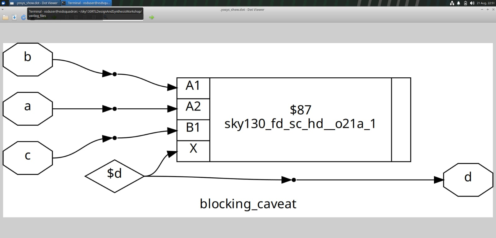
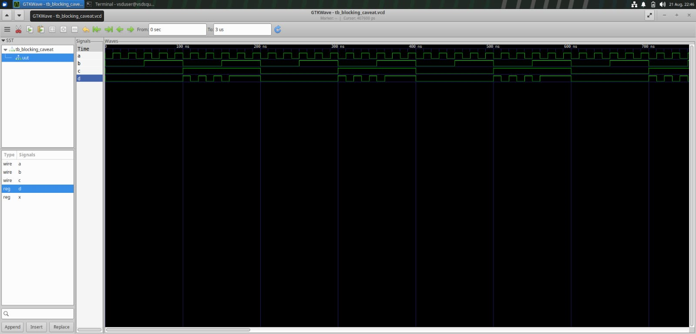
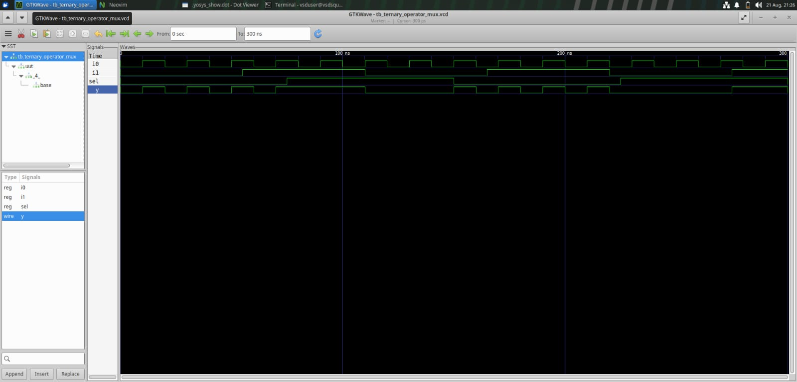
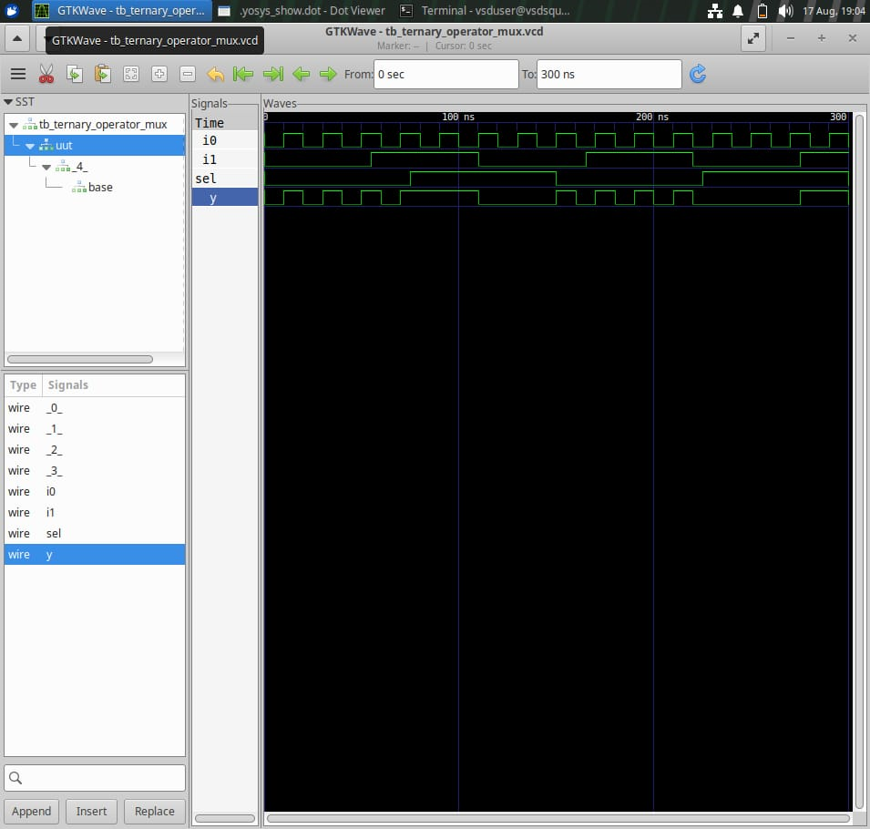

### 🔄 Module 4 – Gate Level Simulation and Synthesis-Simulation Mismatch

This section focuses on Gate Level Simulation (GLS) and understanding situations where RTL simulation results can differ from the behavior of the synthesized design.

The experiments were performed using:

- 🔹 Icarus Verilog
- 🔹 GTKWave
- 🔹 Yosys
- 🔹 SKY130 standard-cell libraries

---

## 🎯 Objective

The objective is to understand:

- Gate Level Simulation (GLS)
- RTL simulation versus synthesized netlist simulation
- Synthesis-simulation mismatch
- Missing sensitivity lists
- Blocking versus non-blocking assignments
- Blocking assignment caveats
- Ternary operator implementation of a MUX
- Technology-specific gate-level netlists
- RTL and GLS waveform comparison

---

## 📚 Topics Covered

- 🔧 Gate Level Simulation (GLS)
- 🔄 RTL simulation vs synthesized netlist simulation
- ⚠️ Synthesis-simulation mismatch
- 🧩 Missing sensitivity list
- ⚙️ Blocking vs non-blocking assignments
- ⚠️ Blocking assignment caveat
- 🔀 Ternary operator implementation of a MUX
- 🧪 RTL and GLS waveform comparison

---

# 1️⃣ Gate Level Simulation

## 🧩 What is GLS?

Gate Level Simulation (GLS) verifies the behavior of the synthesized gate-level netlist using a testbench.

Unlike RTL simulation, the synthesized netlist contains technology-specific standard-cell instances from the SKY130 library.

GLS helps verify whether the synthesized design preserves the intended functionality of the RTL design.

---

## 🔄 General Flow

```text
RTL Design
    ↓
RTL Simulation
    ↓
Yosys Synthesis
    ↓
Technology Mapping
    ↓
Gate-Level Netlist
    ↓
Gate Level Simulation
    ↓
Compare with RTL
```

---

## 💡 Why GLS is Important

Gate Level Simulation is important because it helps to verify the actual synthesized implementation of the design.

It can reveal problems caused by:

- ⚠️ Incorrect RTL coding
- ⚠️ Synthesis-simulation mismatches
- ⚠️ Incorrect reset behavior
- ⚠️ Unknown values
- ⚠️ Gate-level implementation issues
- ⚠️ Incorrect use of Verilog assignments

---

## 📝 RTL Simulation

RTL simulation verifies the behavior of the original Verilog RTL code.

```text
Verilog RTL Code
       ↓
RTL Testbench
       ↓
RTL Simulation
       ↓
GTKWave
```

---

## 📝 Gate Level Simulation

Gate Level Simulation verifies the synthesized gate-level netlist.

```text
Verilog RTL Code
       ↓
Yosys Synthesis
       ↓
Gate-Level Netlist
       ↓
GLS Testbench
       ↓
Gate Level Simulation
       ↓
GTKWave
```

---

## 📊 RTL Simulation vs Gate Level Simulation

| RTL Simulation | Gate Level Simulation |
|---|---|
| Uses RTL Verilog code | Uses synthesized gate-level netlist |
| Mainly checks functional behavior | Checks synthesized implementation |
| Does not contain standard-cell details | Contains standard-cell instances |
| Faster simulation | Usually slower simulation |
| Mainly functional verification | Functional and implementation verification |
| Abstract hardware description | Gate-level hardware description |

---

# 2️⃣ Synthesis-Simulation Mismatch

## ⚠️ What is Synthesis-Simulation Mismatch?

Synthesis-simulation mismatch occurs when the behavior observed during RTL simulation is different from the behavior of the synthesized netlist.

The RTL simulator and synthesis tool may interpret an incorrectly written Verilog design differently.

---

## 🧠 Causes of Synthesis-Simulation Mismatch

Synthesis-simulation mismatch can occur because of:

- Incorrect sensitivity list
- Missing signals in the sensitivity list
- Improper use of blocking assignments
- Improper use of non-blocking assignments
- Incomplete assignments
- Inferred latches
- Race conditions
- Incorrect coding style
- Simulation-only constructs
- Improper reset handling

---

## 💡 Important Point

RTL code must be written carefully so that simulation and synthesis produce the same logical behavior.

Good RTL coding practices help to avoid synthesis-simulation mismatch.

---

# 3️⃣ Missing Sensitivity List

## 🧩 What is a Sensitivity List?

A sensitivity list specifies the signals that cause an `always` block to execute.

Example:

```verilog
always @(a or b)
begin
    y = a & b;
end
```

The block executes whenever `a` or `b` changes.

---

## ⚠️ Problem with Missing Sensitivity List

If a signal is missing from the sensitivity list, the output may not update during RTL simulation.

However, synthesis may still infer the expected combinational logic.

This can create a mismatch between:

- RTL simulation
- Synthesized gate-level simulation

---

## ❌ Incorrect Example

```verilog
always @(a)
begin
    y = a & b;
end
```

In this example, the block is sensitive only to `a`.

If `b` changes while `a` remains unchanged, the output may not update correctly during simulation.

---

## ✅ Recommended Coding Style

For combinational logic, use:

```verilog
always @(*)
begin
    y = a & b;
end
```

The `@(*)` automatically includes all signals used inside the block.

---

## 📝 Observation

Using `always @(*)` helps to avoid sensitivity-list-related simulation errors and improves consistency between RTL simulation and synthesis.

---

# 4️⃣ Blocking and Non-Blocking Assignments

## 🔁 Blocking Assignment

Blocking assignment uses the symbol:

```verilog
=
```

The statement executes immediately and blocks the next statement until it is completed.

Blocking assignments are generally used in combinational logic.

### Example

```verilog
always @(*)
begin
    y = a & b;
end
```

---

## ⏳ Non-Blocking Assignment

Non-blocking assignment uses the symbol:

```verilog
<=
```

The assignment is scheduled and updated at the end of the current simulation time step.

Non-blocking assignments are generally used in sequential logic.

### Example

```verilog
always @(posedge clk)
begin
    q <= d;
end
```

---

## 📊 Difference Between Blocking and Non-Blocking Assignments

| Blocking Assignment `=` | Non-Blocking Assignment `<=` |
|---|---|
| Executes immediately | Updates at the end of the time step |
| Mainly used in combinational logic | Mainly used in sequential logic |
| Statements execute in order | Updates are scheduled |
| Can cause ordering problems | Helps avoid race conditions |
| Represents step-by-step execution | Represents parallel register updates |

---

# 5️⃣ Blocking Assignment Caveat

## ⚠️ What is Blocking Assignment Caveat?

Blocking assignments can produce unexpected simulation results when multiple statements depend on the order of execution.

Consider the following example:

```verilog
always @(posedge clk)
begin
    q1 = d;
    q2 = q1;
end
```

In this example:

1. `q1` is updated immediately with the value of `d`.
2. `q2` receives the updated value of `q1`.
3. Both statements execute in sequence.

---

## 🔄 Non-Blocking Version

```verilog
always @(posedge clk)
begin
    q1 <= d;
    q2 <= q1;
end
```

In this example:

1. `q1` receives the value of `d`.
2. `q2` receives the previous value of `q1`.
3. Both registers are updated at the end of the simulation time step.

---

## 📊 Blocking vs Non-Blocking Example

| Clock Event | Blocking Assignment | Non-Blocking Assignment |
|---|---|---|
| `q1` update | Immediate | Scheduled |
| `q2` value | Updated `q1` value | Previous `q1` value |
| Execution | Sequential | Parallel-style update |
| Recommended use | Combinational logic | Sequential logic |

---

## ✅ Recommended Sequential Coding Style

For flip-flops and sequential circuits, use non-blocking assignments:

```verilog
always @(posedge clk)
begin
    q <= d;
end
```

This better represents the parallel operation of hardware flip-flops.

---

## 📸 Blocking Assignment Caveat



---

# 6️⃣ Blocking Assignment Testbench

## 🧪 What is a Testbench?

A testbench is a Verilog module used to apply input signals to the design under test and verify the output.

A testbench generally contains:

- Input stimulus
- Clock generation
- Reset generation
- Design instantiation
- Output monitoring
- Waveform generation

---

## 🔄 Testbench Flow

```text
Testbench
    ↓
Apply Inputs
    ↓
Design Under Test
    ↓
Generate Outputs
    ↓
Observe Waveform
    ↓
Verify Results
```

---

## 📸 Blocking Assignment Testbench



---

## 📝 Observation

The blocking assignment testbench helps to understand the effect of statement execution order in sequential logic.

It shows why non-blocking assignments are preferred for modelling flip-flops and registers.

---

# 7️⃣ Ternary Operator

## 🔀 What is a Ternary Operator?

The ternary operator is a conditional operator used to select one of two values.

The syntax is:

```verilog
condition ? true_value : false_value
```

The ternary operator is commonly used to implement multiplexers.

---

## 🧠 Ternary Operator Working

The ternary operator checks a condition.

- If the condition is true, the first value is selected.
- If the condition is false, the second value is selected.

Example:

```verilog
assign y = sel ? i1 : i0;
```

Here:

- If `sel = 1`, `y = i1`
- If `sel = 0`, `y = i0`

---

# 8️⃣ Ternary Operator Implementation of a MUX

## 🔀 What is a Multiplexer?

A multiplexer, also called a MUX, is a combinational circuit that selects one input from multiple inputs and sends it to the output.

A 2:1 MUX has:

- Two data inputs
- One select input
- One output

The inputs are:

- `i0`
- `i1`

The select signal is:

- `sel`

The output is:

- `y`

---

## 💻 Verilog Code

```verilog
module ternary_operator_mux (
    input i0,
    input i1,
    input sel,
    output y
);

assign y = sel ? i1 : i0;

endmodule
```

---

## 🧠 Working of 2:1 MUX

The output depends on the select signal.

- When `sel = 0`, input `i0` is selected.
- When `sel = 1`, input `i1` is selected.

---

## 📊 MUX Truth Table

| Select `sel` | Selected Input | Output `y` |
|---|---|---|
| 0 | `i0` | `i0` |
| 1 | `i1` | `i1` |

---

## 📐 Boolean Expression

The Boolean expression of a 2:1 MUX is:

```text
y = sel' i0 + sel i1
```

Where:

- `sel' i0` selects `i0` when `sel = 0`
- `sel i1` selects `i1` when `sel = 1`

---

## 🔄 MUX Operation

```text
       i0 ───────┐
                 │
                 ├──── MUX ──── y
                 │
       i1 ───────┘
                    ▲
                    │
                   sel
```

---

# 9️⃣ Ternary Operator Simulation

The ternary operator MUX was simulated using a Verilog testbench.

The simulation waveform was viewed using GTKWave.

---

## ▶️ Simulation Flow

```text
Verilog MUX Design
       ↓
MUX Testbench
       ↓
Icarus Verilog Simulation
       ↓
VCD File
       ↓
GTKWave
       ↓
Waveform Verification
```

---

## 🧪 Simulation Test Cases

The following input combinations can be applied to verify the MUX:

| `i0` | `i1` | `sel` | Expected Output `y` |
|---|---|---|---|
| 0 | 0 | 0 | 0 |
| 0 | 1 | 0 | 0 |
| 1 | 0 | 0 | 1 |
| 1 | 1 | 0 | 1 |
| 0 | 0 | 1 | 0 |
| 0 | 1 | 1 | 1 |
| 1 | 0 | 1 | 0 |
| 1 | 1 | 1 | 1 |

---

## 📸 Ternary Operator Testbench



---

## 📝 Simulation Observation

The simulation verifies the operation of the 2:1 multiplexer.

- When `sel = 0`, the output follows `i0`.
- When `sel = 1`, the output follows `i1`.
- The output changes according to the selected input.
- The ternary operator correctly implements the MUX function.

---

# 🔟 GTKWave Simulation

## 🖥️ What is GTKWave?

GTKWave is a waveform viewer used to observe and analyze digital simulation results.

It displays signals generated during Verilog simulation.

The signals may include:

- Clock
- Reset
- Input signals
- Output signals
- Select signals
- Internal signals

---

## 💡 Importance of GTKWave

GTKWave helps to:

- Verify the functionality of the design
- Observe signal transitions
- Check input-output relationships
- Identify incorrect output values
- Analyze timing behavior
- Compare simulation results

---

## 📸 GTKWave Waveform



---

## 📝 GTKWave Observation

The GTKWave waveform shows the relationship between the input signals, select signal, and output signal.

The output follows the selected input according to the MUX truth table.

---

# 1️⃣1️⃣ Simulation and Verification

Simulation is performed to check the logical behavior of the RTL design before hardware implementation.

The design is tested by applying different input combinations through a testbench.

---

## 🔄 General Simulation and Verification Flow

```text
Verilog Design
      ↓
Testbench
      ↓
Input Stimulus
      ↓
Icarus Verilog Simulation
      ↓
VCD Waveform
      ↓
GTKWave Analysis
      ↓
Verification
```

---

## 🧪 Verification Steps

1. Write the Verilog RTL design.
2. Write the testbench.
3. Apply different input combinations.
4. Compile the Verilog files.
5. Run the simulation.
6. Generate the VCD waveform file.
7. Open the waveform using GTKWave.
8. Compare the actual output with the expected output.
9. Verify the functionality of the design.

---

## 📝 Verification Result

The MUX output was verified for different values of the select signal.

The output correctly follows:

- `i0` when `sel = 0`
- `i1` when `sel = 1`

The simulation confirms the expected functionality of the ternary operator-based MUX.

---

# 1️⃣2️⃣ Tools Used

The following tools were used during this module:

- 🛠️ Icarus Verilog
- 📊 GTKWave
- ⚙️ Yosys
- 💻 Linux Terminal
- 📝 Verilog HDL
- 🔬 SKY130 standard-cell libraries

---

# 1️⃣3️⃣ Files Used

The following files and screenshots were used in this module:

- `blocking_caveat.png`
- `tb_blocking_caveat.png`
- `tb_ternary_operator.png`
- `ternary_GTK.png`

---

# 1️⃣4️⃣ Important Verilog Coding Guidelines

- Use `always @(*)` for combinational logic.
- Use `always @(posedge clk)` for positive-edge-triggered sequential logic.
- Use blocking assignments for combinational logic.
- Use non-blocking assignments for sequential logic.
- Assign outputs completely inside combinational blocks.
- Avoid incomplete sensitivity lists.
- Avoid unintended latch inference.
- Use reset signals carefully.
- Use a proper testbench for verification.
- Compare expected and actual outputs.
- Check RTL waveforms using GTKWave.
- Write clean and readable Verilog code.

---

# 1️⃣5️⃣ Learning Outcome

After completing this module, I understood:

- The basic concepts of RTL design.
- The use of Verilog HDL for digital circuit design.
- The difference between blocking and non-blocking assignments.
- The importance of correct assignment types.
- The blocking assignment caveat.
- The working of a 2:1 multiplexer.
- The use of the ternary operator in Verilog.
- The importance of testbenches.
- The process of RTL simulation.
- The use of GTKWave for waveform analysis.
- The importance of simulation and verification.
- The basic concept of Gate Level Simulation.
- The causes of synthesis-simulation mismatch.

---

# ✅ Conclusion

This module provided practical knowledge of RTL design and Verilog HDL.

I learned how to implement digital circuits, write testbenches, and verify the design using simulation waveforms.

The blocking assignment experiment helped me understand how statement execution order can affect sequential circuit behavior.

The non-blocking assignment concept helped me understand why non-blocking assignments are preferred for sequential logic.

The ternary operator experiment helped me understand the implementation and simulation of a 2:1 multiplexer.

GTKWave helped me observe input and output transitions and verify the functionality of the design.

Overall, this module improved my understanding of RTL design, Verilog coding styles, simulation, waveform analysis, and digital circuit verification.
